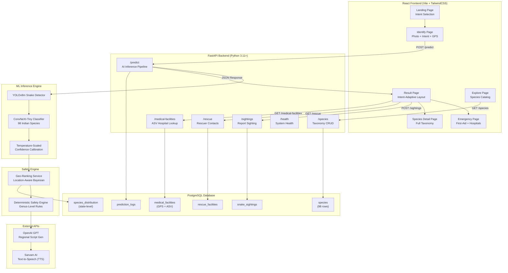
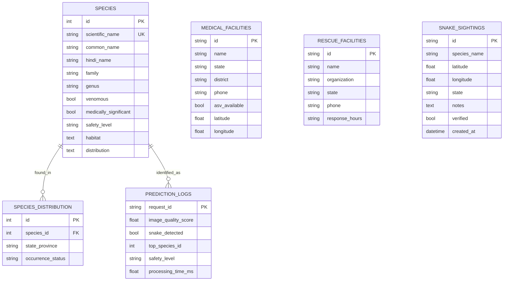

# NaagRakshak — Full System Architecture

> **India-Focused AI Snake Intelligence & Safety Platform**
> Identification → Verification → Safety → Rescue → Hospital → Sighting Reports → Education

---

## 1. High-Level System Architecture



---

## 2. Frontend Architecture

### Tech Stack
| Layer | Technology |
|---|---|
| Framework | React 18 + React Router v6 |
| Build Tool | Vite 6.4 |
| Styling | TailwindCSS 4.x |
| HTTP Client | Axios |
| Icons | Lucide React |

### Component Hierarchy

```
App.jsx
├── Header.jsx (sticky nav, location, language selector)
├── LocationModal.jsx (GPS detect + manual state/district)
├── Routes
│   ├── LandingPage.jsx (intent cards → /identify or /emergency)
│   ├── IdentifyPage.jsx (camera/upload/preset → POST /predict → /result)
│   ├── ResultPage.jsx ★ INTENT-ADAPTIVE LAYOUT
│   │   ├── SafetyBanner.jsx (CRITICAL/CAUTION/LOW)
│   │   ├── AudioPlayer (Sarvam TTS regional audio)
│   │   ├── SpeciesCard (image + traits + classification)
│   │   ├── ConfidenceMeter.jsx (detection + classification bars)
│   │   ├── TopKCandidates (multi-species probability list)
│   │   ├── FieldProtocol (3-rule safety grid)
│   │   ├── HospitalFinder.jsx (GET /medical-facilities, distance, nav)
│   │   ├── RescuerFinder.jsx (GET /rescue, tap-to-call)
│   │   ├── ReportSightingSection (POST /sightings inline form)
│   │   ├── ShareIdentification (navigator.share / clipboard)
│   │   ├── EmergencyQuickCall (1-tap tel:112, bite-only)
│   │   └── AIDisclaimer (amber warning banner)
│   ├── EmergencyPage.jsx (WHO first-aid + hospitals)
│   ├── ExplorePage.jsx (species catalog, search, filter)
│   └── SpeciesDetailPage.jsx (full taxonomy profile)
└── Footer.jsx
```

### Intent-Adaptive Result Page Layout

| Section | Encounter | Bite | Study | Wildlife ID |
|---|---|---|---|---|
| Emergency Quick-Call | — | **1st (top)** | — | — |
| Safety Banner | 1st | 2nd | 4th | 3rd |
| Audio Alert | 2nd | 3rd | 3rd | 4th |
| Field Protocol | 3rd | — | — | — |
| Species Card + Traits | 4th | 5th | **1st (top)** | 2nd |
| Top-K Candidates | 5th | 6th | 2nd | **1st (top)** |
| Snake Rescuer | 6th | 7th | — | — |
| Hospital Finder | 7th | **4th** | — | — |
| Report Sighting | 8th | — | 5th | 5th |
| Share + Learn Links | 9th | 8th | 6th | 6th |
| AI Disclaimer | **Always last** | **Always last** | **Always last** | **Always last** |

### Context Providers

| Context | Purpose |
|---|---|
| `LocationContext` | GPS coordinates, state/district name, formatted location |
| `LanguageContext` | Selected regional language code (hi-IN, bn-IN, ta-IN, etc.) |

---

## 3. Backend Architecture

### Tech Stack
| Layer | Technology |
|---|---|
| Framework | FastAPI (async) |
| ORM | SQLAlchemy 2.0 (async) |
| Database | PostgreSQL 16 |
| ML Runtime | PyTorch + torchvision |
| Image Processing | Pillow + OpenCV |
| Validation | Pydantic v2 |

### API Endpoint Map

| Method | Endpoint | Purpose | Auth |
|---|---|---|---|
| `GET` | `/api/v1/health` | System health + DB + model status | None |
| `POST` | `/api/v1/predict` | AI snake identification (image to species + safety + audio) | None |
| `GET` | `/api/v1/species` | Paginated species catalog (search, filter) | None |
| `GET` | `/api/v1/species/{id}` | Single species full taxonomy detail | None |
| `GET` | `/api/v1/medical-facilities` | ASV hospitals (state filter, GPS distance sort) | None |
| `GET` | `/api/v1/rescue` | Snake rescue facility contacts (state filter) | None |
| `POST` | `/api/v1/sightings` | Report snake sighting (lat/lng, species, notes) | None |

### `/predict` Pipeline (9 Stages)

```mermaid
flowchart LR
    A["1. Image Validation<br/>(JPEG/PNG/WEBP/Base64)"] --> B["2. Quality Analysis<br/>(Laplacian Blur Score)"]
    B --> C["3. ML Inference<br/>(Detect + Classify + Calibrate)"]
    C --> D["4. Geo-Ranking<br/>(Location-Aware Bayesian)"]
    D --> E["5. Safety Engine<br/>(Genus Rules + Intent Overrides)"]
    E --> F["6. Hospital Lookup<br/>(Nearest ASV + Distance)"]
    F --> G["7. OpenAI Script Gen<br/>(Regional Language)"]
    G --> H["8. Sarvam TTS<br/>(Voice Audio Base64)"]
    H --> I["9. Response Composer<br/>(Intent-Driven JSON)"]
```



### Safety Engine Rules (Priority Order)

```
Rule 0: UNABLE_TO_IDENTIFY + BITE intent → CRITICAL (assume worst case)
Rule 1: UNABLE_TO_IDENTIFY → CAUTION (assume potentially venomous)
Rule 2: Dangerous Genus Match → CRITICAL + venomous=true + antivenom=true
         Genera: Echis, Daboia, Naja, Bungarus, Ophiophagus, Hypnale, Trimeresurus
Rule 3: Venomous (mild/moderate) → HIGH
Rule 4: Non-venomous + BITE intent → CAUTION (wound infection risk)
Rule 5: Non-venomous + non-bite → LOW (harmless, ecosystem protector)
```

---

## 4. ML Training Pipeline

### Model Architecture
| Component | Architecture | Input | Output |
|---|---|---|---|
| Detector | YOLOv8m (custom) | 640x640 RGB | Snake BBox + confidence |
| Classifier | ConvNeXt-Tiny (fine-tuned) | 224x224 RGB (cropped) | 98-class probability vector |
| Calibration | Temperature Scaling | Raw logits | Calibrated probabilities |

### Training Data
| Source | Count | Notes |
|---|---|---|
| India-native species photos | ~15,000 | Web-scraped + iNaturalist + GBIF |
| Big Four augmented | ~4,000 | Heavy augmentation for Cobra, Krait, Viper, Echis |
| Lookalike species | ~3,000 | Rat Snake, Wolf Snake, Cat Snake, Checkered Keelback |
| class_mapping.csv | 98 classes | Maps class index to scientific name |
| indian_snakes.csv | 98 rows | Full metadata (venom, family, genus, habitat, names) |

### Confidence Calibration Strategy
```
if calibrated_confidence >= 0.65 → HIGH_CONFIDENCE (show top-1)
if 0.35 <= calibrated_confidence < 0.65 → MODERATE_CONFIDENCE (show top-K)
if calibrated_confidence < 0.35 → UNABLE_TO_IDENTIFY (abstain, show CAUTION)
```

---

## 5. Database Schema



---

## 6. Data Flow: End-to-End User Journey

```
User opens app → Landing Page (select intent card)
       |
Identify Page → Select intent + state + GPS + upload photo
       |
POST /api/v1/predict (image + intent + state + language + lat/lng)
       |
Backend Pipeline:
  1. Validate image (size, format, corruption check)
  2. OpenCV quality score (Laplacian blur metric)
  3. YOLOv8 snake detection → crop bounding box
  4. ConvNeXt-Tiny classification → 98-class probabilities
  5. Temperature-scaled calibration → top-K candidates
  6. Location-aware Bayesian re-ranking (state distribution)
  7. Deterministic Safety Engine (genus rules + intent overrides)
  8. OpenAI GPT → regional language script (snake name + action + hospital)
  9. Sarvam AI TTS → base64 WAV audio
  10. Compose JSON response (predictions, safety, guidance, audio)
       |
Result Page (intent-adaptive layout):
  - BITE: Emergency call → Safety → Audio → Hospitals → Rescuers
  - ENCOUNTER: Safety → Audio → Protocol → Rescuers → Hospitals → Report
  - STUDY: Species card → Top-K → Audio → Safety → Report
  - WILDLIFE: Top-K → Species → Safety → Audio → Report
       |
User Actions: Listen audio | Find hospital | Call rescuer | Report sighting | Share | Learn
```

---

## 7. What Can Be Improved (Future Roadmap)

### High Priority

| Improvement | Description |
|---|---|
| **User Authentication** | Add JWT/OAuth login so sighting reports, prediction history, and user preferences are tied to accounts. Currently all endpoints are unauthenticated. |
| **Expert Verification Pipeline** | Add a moderation queue where herpetologists can verify/reject AI identifications and community sighting reports before they become authoritative. Currently verified=False is set but never reviewed. |
| **PostGIS Extension** | Replace Haversine Python calculation with native PostgreSQL ST_DistanceSphere for 10-100x faster hospital/rescuer distance queries at scale. Current Haversine is in-Python post-query. |
| **Real Hospital Data** | Current ASV hospital data is a small seed (2 Bihar, 2 WB, 2 MH, 2 Delhi). Need verified data from National Health Mission / MoHFW for all 750+ district hospitals. |
| **Offline Mode (PWA)** | Convert to Progressive Web App with service worker caching. Rural India often has no internet — model inference should work offline using ONNX.js or TFLite WebAssembly. |

### Medium Priority

| Improvement | Description |
|---|---|
| **Sighting Heatmap Visualization** | Use reported sightings to render a geographic distribution heatmap (Leaflet/Mapbox) showing snake species density across Indian states. |
| **Image Evidence for Sightings** | Currently image_reference in sightings is null. Add S3/Cloudflare R2 image upload so sighting photos are stored and reviewable. |
| **Multi-Image Upload** | Allow users to upload 2-3 photos (dorsal, ventral, head close-up) for higher classification accuracy. |
| **Feedback Loop** | Let users correct misidentifications. Use confirmed corrections as new training data for model retraining (active learning). |
| **Rate Limiting** | Add request rate limiting to prevent API abuse (OpenAI + Sarvam cost real money per call). |
| **Real Rescue Data** | Partner with Wildlife SOS, Sarpa Mitra, and state Forest Department databases for verified rescuer contacts across all states. |

### Nice to Have

| Improvement | Description |
|---|---|
| **Community Forum** | In-app community for snake ID help, rescuer networking, and educational discussions. |
| **Seasonal Alerts** | Push notifications during monsoon season (peak snake activity June-September) with regional safety reminders. |
| **Model Explainability** | Grad-CAM or SHAP overlays showing which image regions the model focused on for classification. |
| **WhatsApp Bot** | Many rural users are WhatsApp-first. A WhatsApp bot accepting snake photos and returning safety results would dramatically expand reach. |
| **Multi-Language UI** | Currently audio is multilingual but the UI text is English-only. Full Hindi/Bengali/Tamil/Marathi UI translations would improve accessibility. |
| **Venom Profile Database** | Detailed venom composition data (neurotoxins, hemotoxins, cytotoxins) with clinical symptom timelines for each species. |
